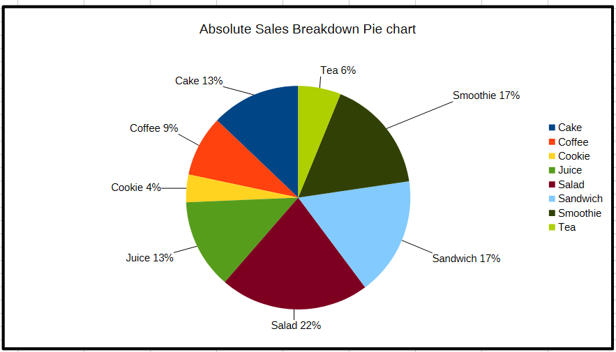
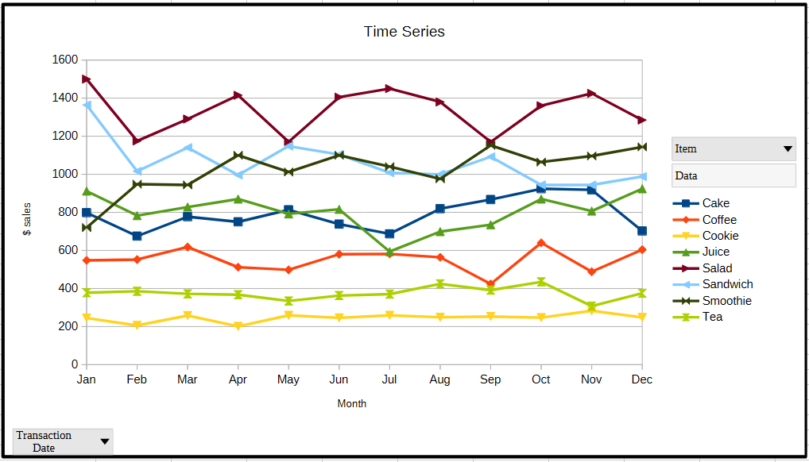

# Cafe Sales Dataset

## Key Visualizations

* **Insight:** Non-coffee categories (salads, smoothies, and sandwiches) represent a major portion of absolute sales, proving that food items are primary revenue drivers alongside beverages.

* **Insight:** Monthly sales for individual items remain remarkably stable and predictable throughout the year, fluctuating within revenue bands. More importantly, there is no upward trajectory.
