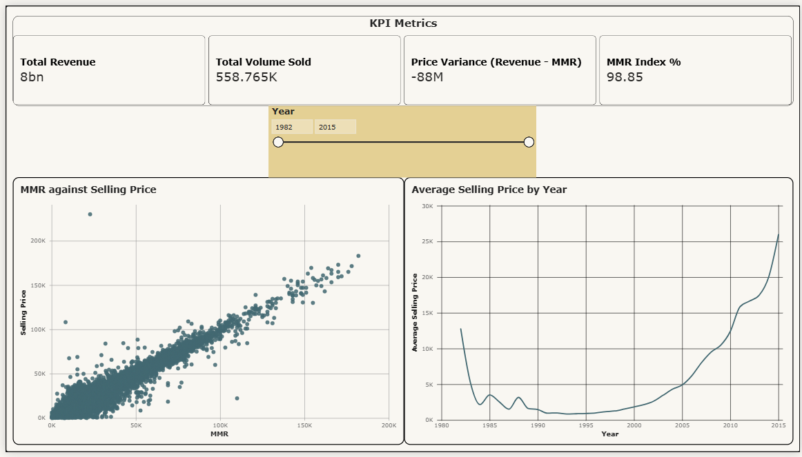
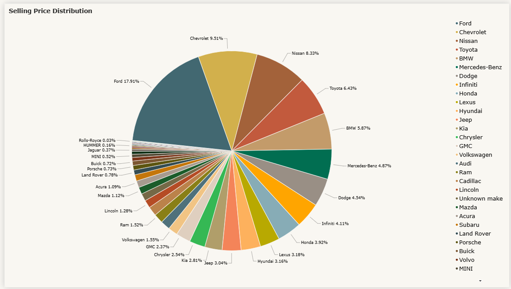
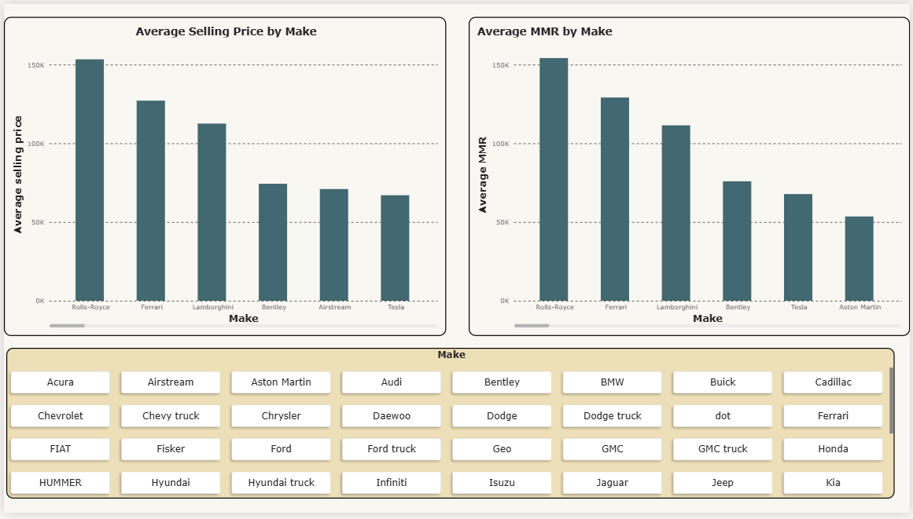
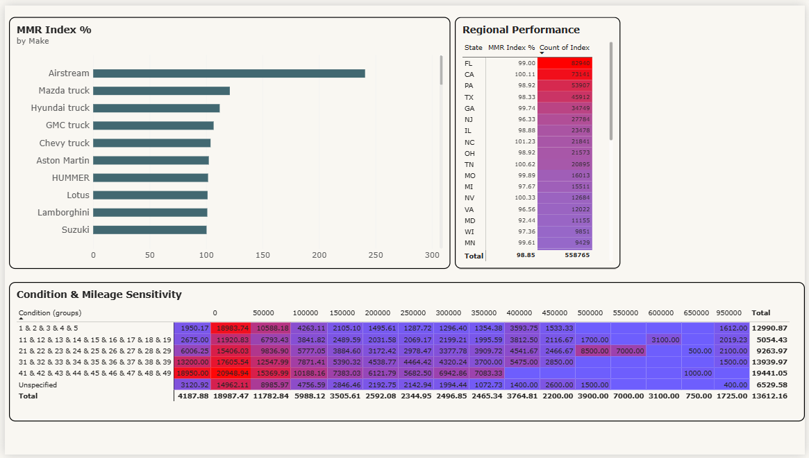

# Vehicle Sales & Valuation Analysis Dashboard 

## Project Overview
The goal of this project is to perform end-to-end data cleaning and build an interactive multi-page Power BI dashboard from the perspective of a **Pricing Analyst**. The dashboard evaluates sales volume, revenue performance, market realization rates (Selling Price vs MMR), and asset depreciation trends across 550,000+ vehicle transactions.

**Tools Used:** LibreOffice Calc / Python (Data Cleaning), Power BI (DAX, Modeling, Visualization).

---

## Dashboard Pages & Strategic Insights

### 1. Executive Summary & Pricing Efficiency

* **Key Metrics:** Tracks high-level KPIs including Total Revenue, Volume Sold, Price Variance (Selling Price - MMR), and MMR Index Percentage (Selling Price / MMR * 100).

* **Pricing Efficiency (Scatterplot):** Analyzes transactions between 1982 and 2015. Demonstrates a strong positive correlation between selling price and MMR, confirming that actual transaction values generally track baseline market expectations, with a few notable outliers.

* **U-Shaped Depreciation Curve:** Uncovers a classic U-shaped valuation curve where newer models and older/vintage models command premium prices, while mid-aged vehicles sit in a pricing valley.
    * *Insight:* Older vehicles benefit from survivor rarity, utility retention, and nostalgia/collector status. Over the next few decades, today's mid-aged commuter will follow this same transition into collectible assets.

---

### 2. Market Share & Pricing Realization

* **Revenue Distribution:** Highlights brand market share, showing **Ford** and **Chevrolet** generating the highest sales revenue in the dataset.

* **Benchmark Variance:** Compares Average Selling Price against Average MMR across manufacturers. While most brands align closely with market valuation, there are some that do not follow that trend, highlighting potential arbitrage or mispricing opportunities.

---

### 3. Market Sensitivity

* **Matrix Analytics & Regional Performance:** Evaluates regional price realization across state auction locations alongside a Condition vs. Mileage heatmap matrix to isolate how wear and tear impact residual value retention.