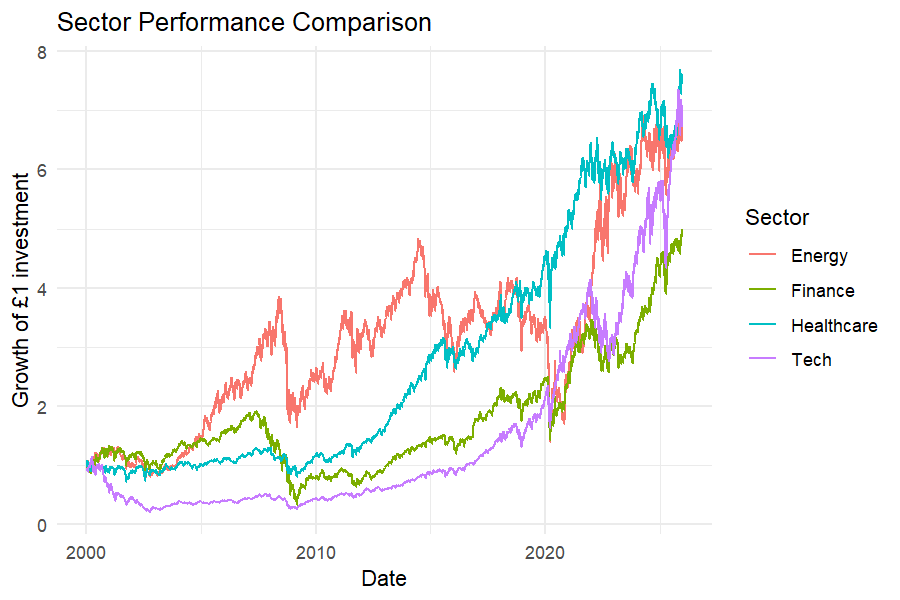
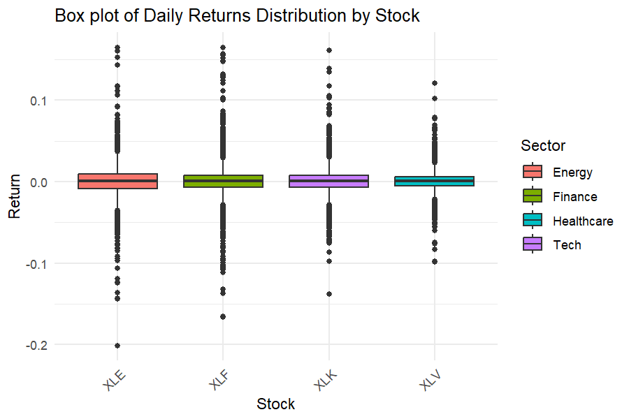
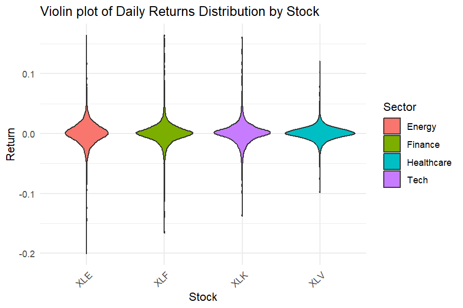
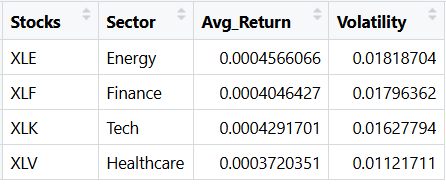
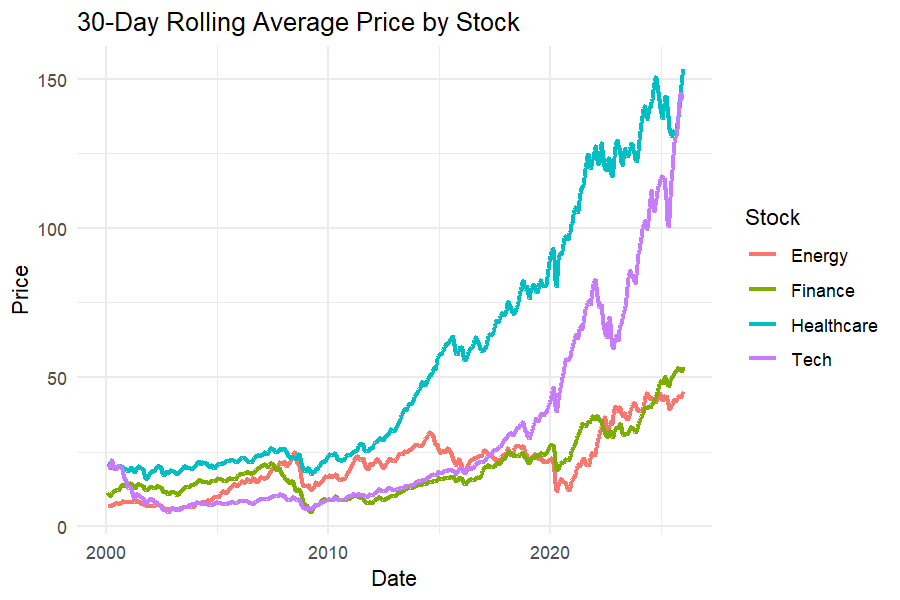
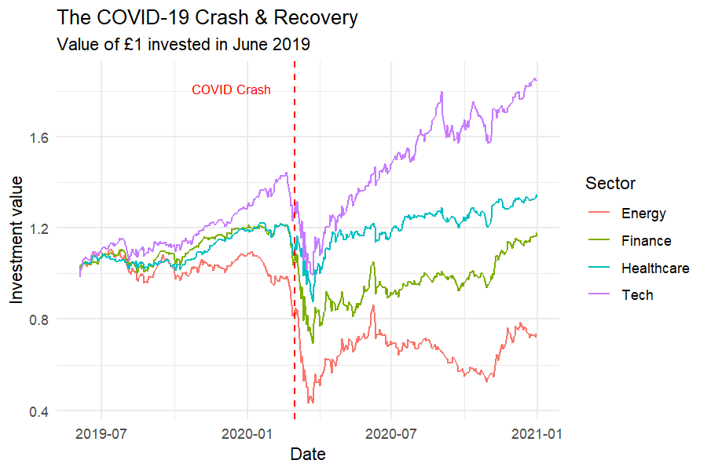
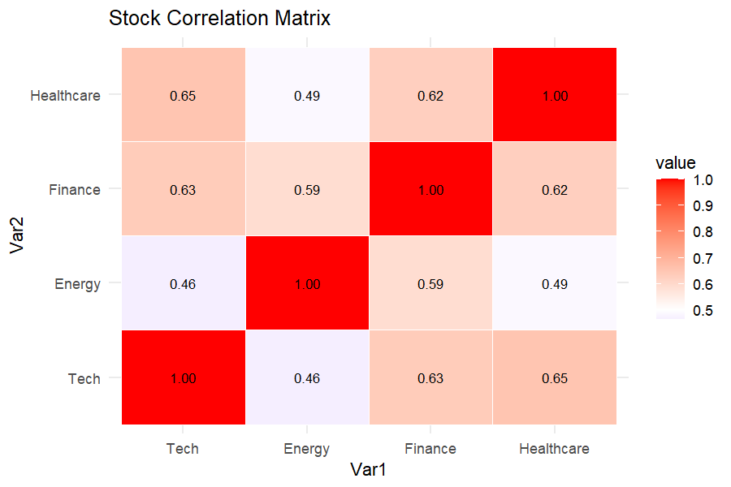
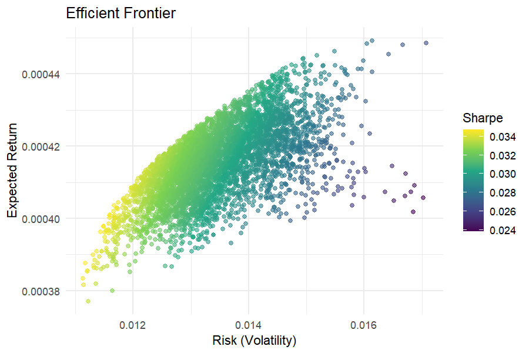
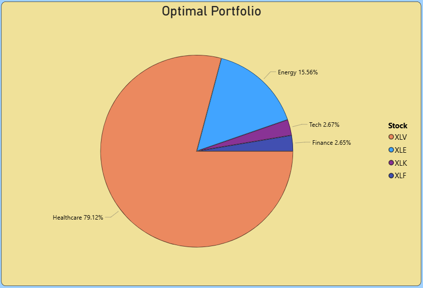
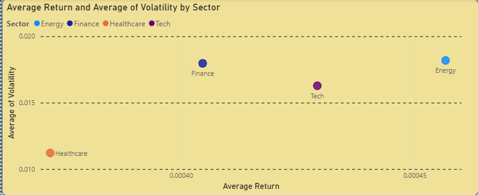

### Research purpose
This quantitative analysis explores how different market sectors react to systemic shocks and how their growth trajectories and risk profiles diverge over a 25-year period. By utilizing sector-specific ETFs, this project aims to provide a survivorship-bias free look at market dynamics.

### Summary
Key insights include:

* The Energy sector is the high-risk high-reward investment
* The healthcare sector can provide consistent, lower-volatility returns, which can be a stabilizing force in a portfolio
* A data-driven Monte Carlo simulation reveals that maximizing the Sharpe ratio requires to focus more on defensive sectors, such as Healthcare, to offset the noise of high-volatility sectors.

### Data overview
Data was sourced from quantmod package in R, covering the period from 2000 to 2025. To ensure a representative analysis, Sector Select SPDR ETFs were used as proxies. These are XLK (Technology Select Sector SPDR Fund), XLE (Energy Select Sector SPDR Fund), XLV (Healthcare Select Sector SPDR Fund), and XLF (Financial Select Sector SPDR Fund). This selection matters because if specific sectors were chosen, then it would introduce survivorship bias. 

### Exploratory Data Analysis
Various methods of research have been used, such as ANOVA testing, Levene's test, rolling-30, and Monte Carlo.

 

#### Section A: Performance of each sector and returns

 

The 25-year time series highlights distinct sector behaviours. While the 2008 Financial Crisis and 2020 COVID-19 pandemic impacted all sectors, the recovery shapes differed significantly. Healthcare and Tech sectors exhibited resilient long-term compounding, whereas Energy remained highly sensitive to cycles.

  

 

For the Energy sector, both the box and violin plots reveal a wide data spread, indicating high variance and frequent extreme price moves. On the other hand, for the Healthcare sector, the data is more tightly clustered around the mean, confirming more predictable daily performance.

An initial ANOVA testing was performed on daily and monthly returns and yielded a p-value of 0.99. What this means is that every sector moves at an average speed.

 

#### Section B: Risk and Volatility
Standard deviation was calculated per sector, and then volatility was measured.

 

Based on the table, the sector with the most volatility is the Energy sector, followed by the Finance and then Tech sectors. The Healthcare sector shows the least amount of volatility, but also the least amount of returns.

A Levene's test result shows that volatility is significantly different across sectors. The ANOVA results did not show differences because the daily and monthly returns are noisy, but risk between sectors is not noise, but rather a fundamental characteristic of the sector.

 

#### Section C: Trends and Market Reactions
The 30-day rolling average method filters out daily noise, revealing that the Healthcare sector maintains smoother upward trajectory. In contrast, the Energy sector's average is frequently disrupted by volatility, often leading to lower sustained averages despite occasional high-growth bursts.

  

Next, the data was tested on the concept of market shock such as COVID-19.

 

The COVID-19 event analysis illustrates that while the entire market suffered a systemic drop, the recovery architecture was sector-dependent. 

The Tech and Healthcare sectors had a V-shaped recovery, which means a rapid rebound to pre-pandemic levels achieved within months.
Energy and Finance had a U-shaped recovery, meaning that the recovery was relatively slower.

A t-test reveals that the shock was just a volatility event rather than a permanent market change. What this means is that the trends have remained relatively the same, meaning that the average speed growth of the market was not affected.

 

#### Section D: Correlation and Diversification

 

The correlation heatmap reveals the Healthcare and Tech sectors have the highest correlation (r = 0.65), suggesting that they react similarly to market events. 
Tech and Energy sectors have a weak positive correlation (r = 0.46), which means that if the Tech sector was somehow affected, then the Energy sector will not be affected as much. This is important when considering where to invest because having a diverse portfolio will mean that if a sector is being affected dramatically, then you can fall back on other stocks from other sectors.

 

#### Section E: Portfolio Optimization
This section analyses how much should one invest in each sector. Sharpe ratio (investment's risk-adjusted return) was measured between the sectors, and Monte Carlo was used to simulate different variants of portfolios (5000 simulations).

  

 

The optimal portfolio shows the weights for each sector in which you should invest in. Based on the Sharpe ratio calculations, one should consider investing more into Healthcare at least by 79.1%, followed by investing 15.6% in Energy and so on.

 

 

The plot here shows that Energy is indeed the high-risk high-reward sector, and that Healthcare is the sector with low-risk low-returns.

### Conclusion
The data proves that while Tech and Energy sectors show promise of high-growth, it is far safer to invest in the Healthcare sector. For long-term investors, the path to wealth is not just about finding highest returns, but also managing the cost of volatility. The most efficient portfolio is one that uses defensive anchors to survive market shocks, allowing compounding to do its work over decades.