# Project Purpose
This study presents a cross-regional statistical analysis of YouTube Algorithm dynamics across three distinct geographic markets: North America (**United States**), Europe (**Germany**), and Asia (**South Korea**).

The four primary research questions include:

1. Does publishing time actually accelerate a video's journey to the Trending page? 

2. Are certain video categories significantly more reliant on audience engagement than others?

3. Do 'Clickbait' title elements (All-Caps, Exclamation Marks) correlate with higher view-to-like conversion?

4. Is comment disabling random or strongly associated with specific categories and negative sentiment?

---

# Summary
Key insights discovered:

* **Publishing Day Velocity:** Day of publication significantly impacts time-to-trend velocity across all regions. Mid-to-late week uploads (where Sundays are included) consistently exhibits faster trending speeds compared to early-week uploads.
* **Cross-Regional Variance Heterogeneity:** South Korea satisfied the assumption of equal variance, validating One-Way ANOVA and Tukey's HSD post-hoc testing. Conversely, US and German markets exhibited significant heteroscedasticity, necessitating Welch's ANOVA and Games-Howell post-hoc evaluation.
* **Engagement Reliance:** Across all three regions, Welch's Two-Sample $t$-tests confirmed that audience engagement reliance [(Lies + Comments) / Views] varies systematically by category type, with interaction-heavy content requiring distinct engagement threshold compared to informational channels.
* **Clickbait vs Engagement:** ALL-CAPS ratios displayed weak-to-moderate positive correlations with like conversion rates ($r \approx 0.17 - 0.21, p < 0.001$), whereas exclamation mark frequency demonstrated negligible practical effect sizes ($r < 0.08$).
* **Comment Disabling Independence:** While Chi-Square tests of independence yielded statistical significance ($p < 0.05$) due to large sample sizes ($N > 40,000$), Cramer's $V$ effect sizes confirmed that comment disabling is largely independent of category classification or high dislike ratios ($V < 0.10$).

---

# Exploratory Data Analysis

Log-transformed view counts ($\log_{10}(\text{Views})$) exhibit near-normal, bell-shaped distributions across all regional datasets, supporting the application of parametric inferential testing (ANOVA, Welch's $t$-test, Pearson's correlation).

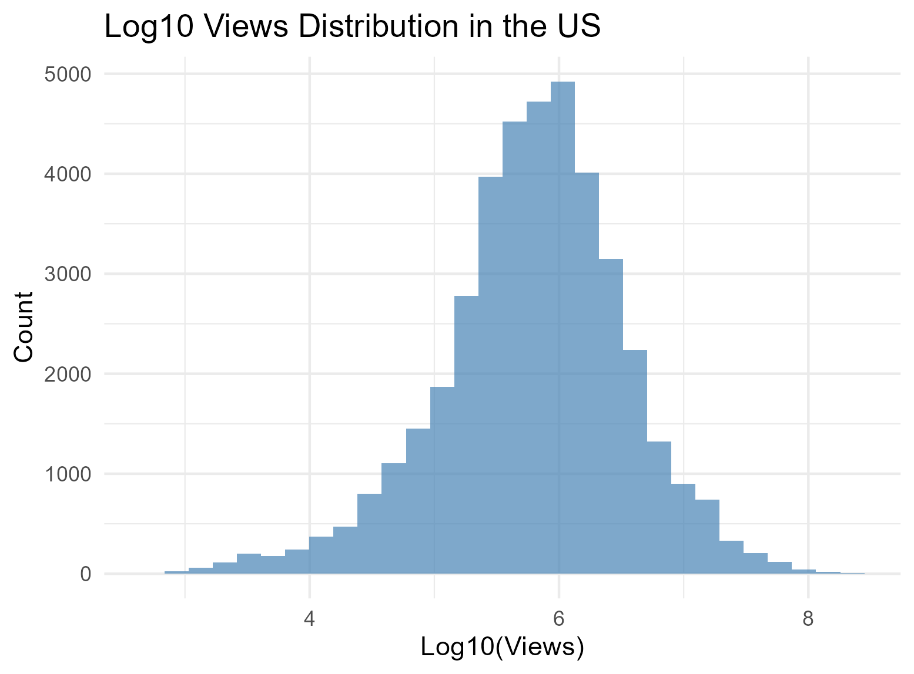

 

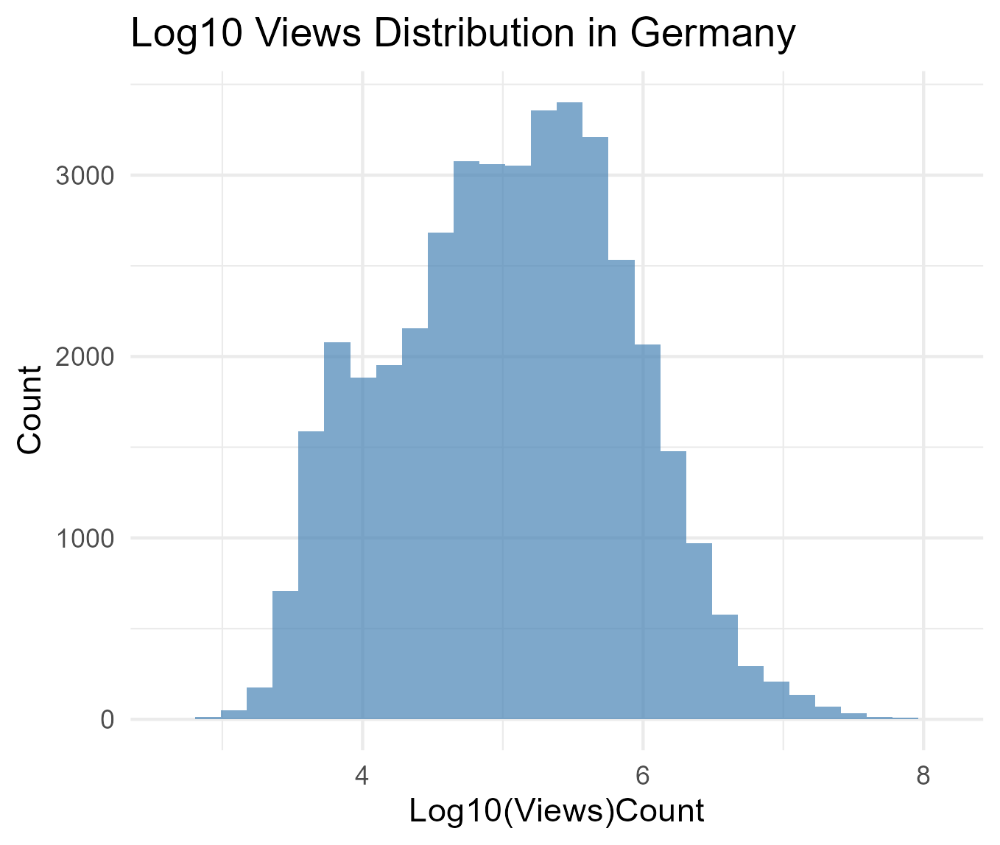

 

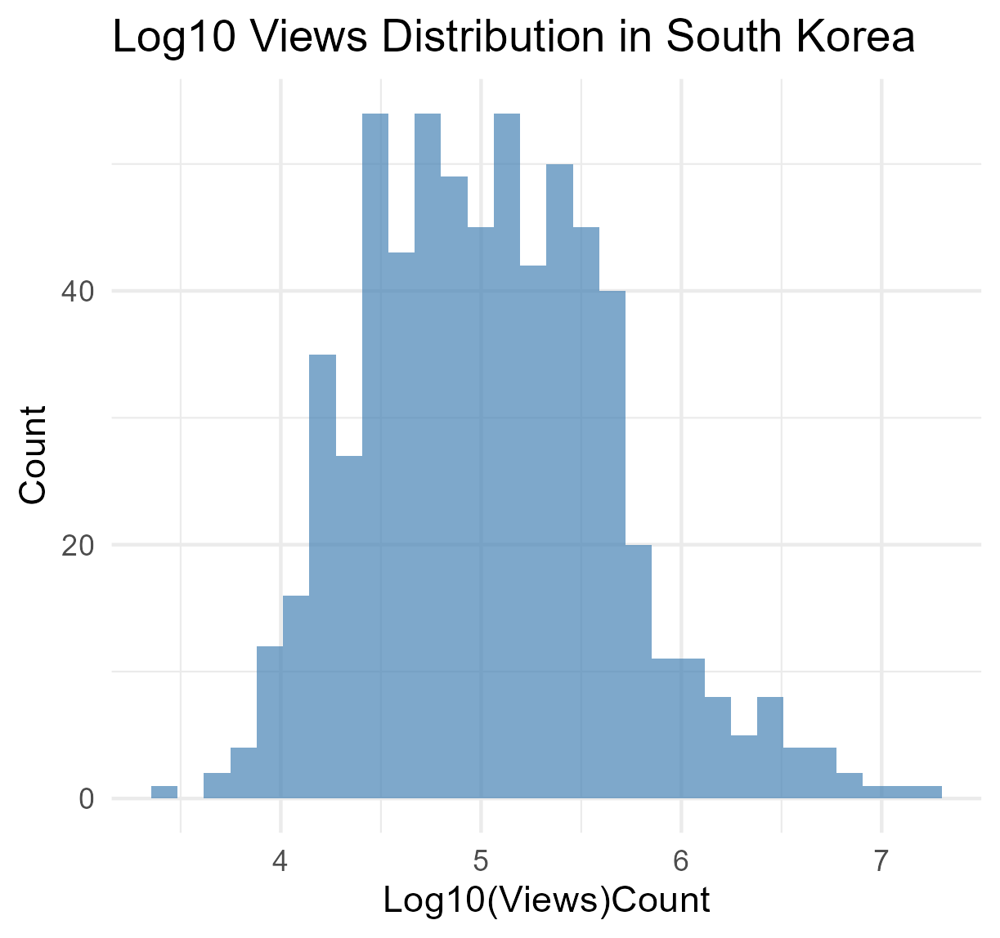

 

### Category Distributions across Regions

To establish comparative baselines, regional composition was evaluated across YouTube video categories.

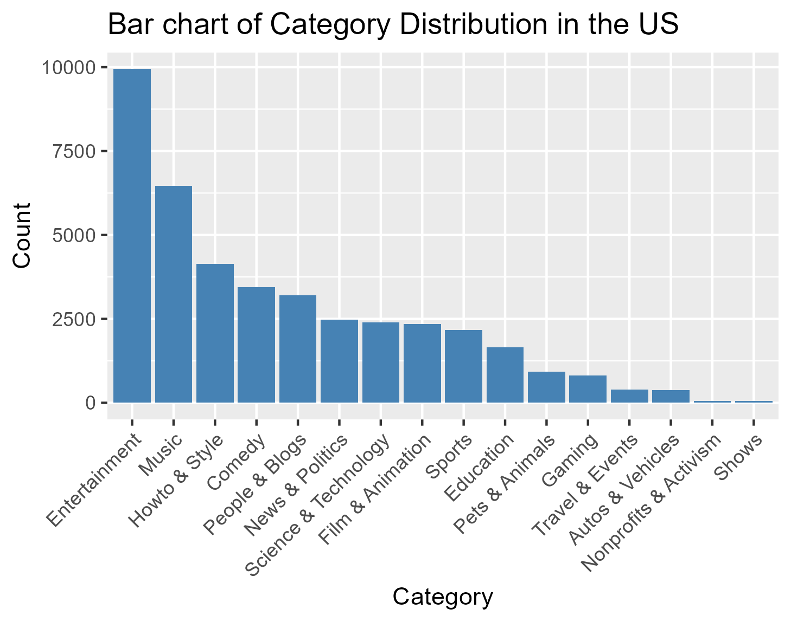

 

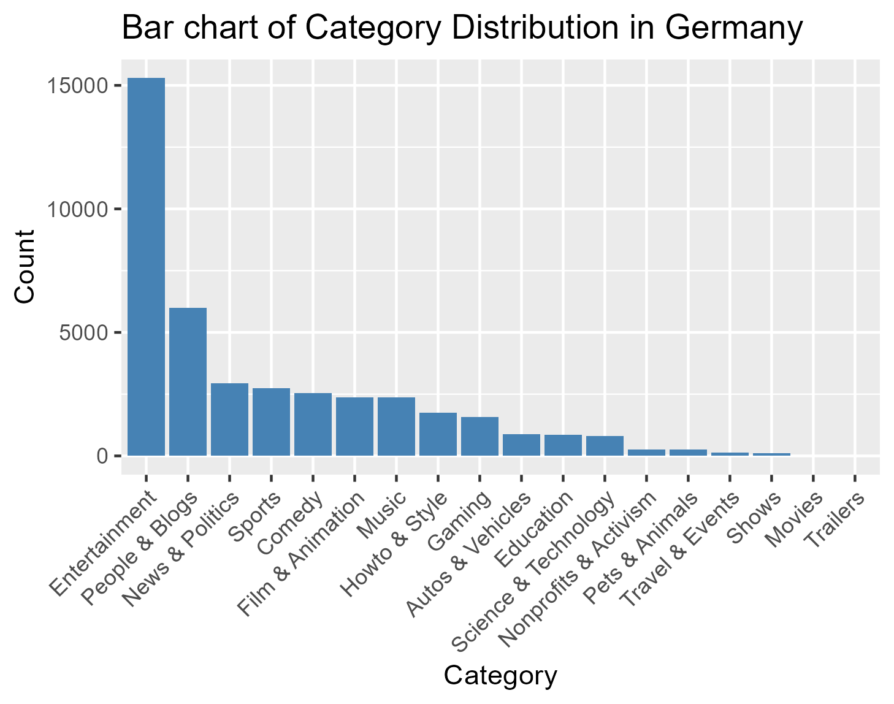

 

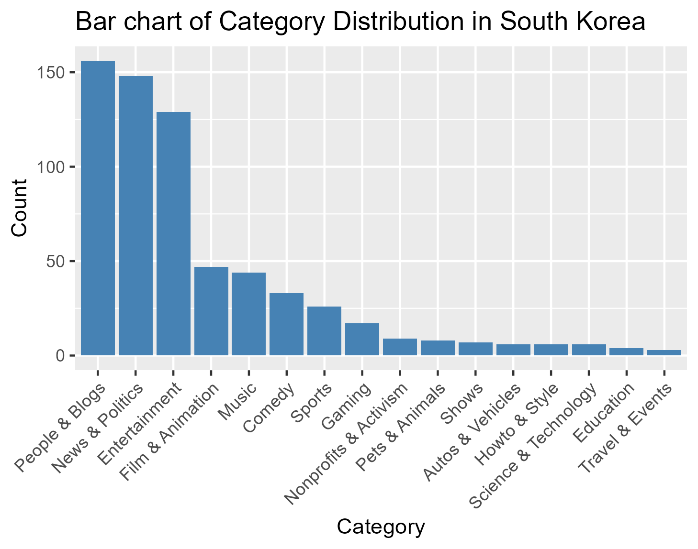

---

# Statistical Analysis

### 1. Publishing Day Impact on Time-to-Trend Velocity

The target metric `days_to_trend` displays a strong right-skew, indicating that the vast majority of trending videos reach peak visibility within a few days of upload.

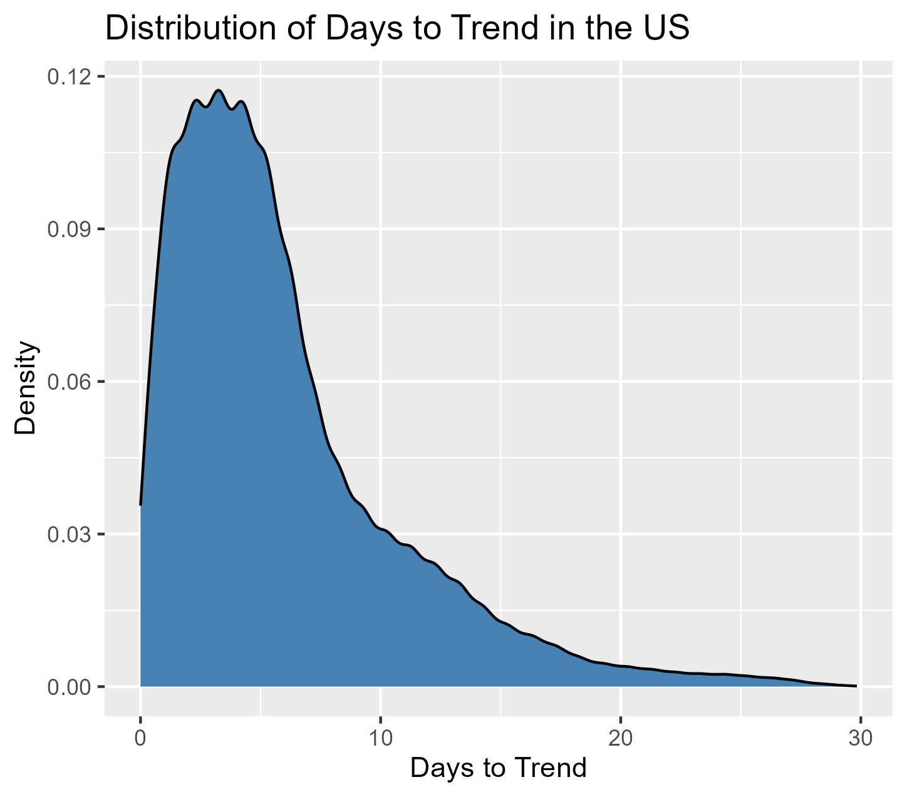

 

#### United States & Germany (Heteroscedastic Datasets)
Levene’s Test for Homogeneity of Variance was statistically significant ($p < 0.05$) for the US and German datasets, confirming heteroscedasticity. Consequently, **Welch’s ANOVA** was paired with **Games-Howell post-hoc tests** to evaluate pairwise day differences.

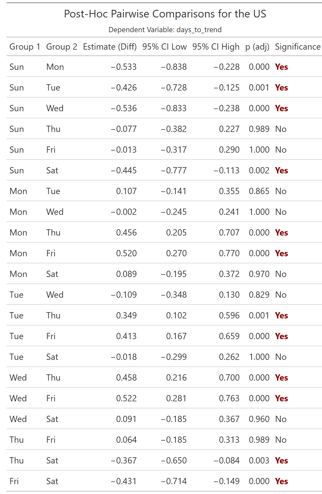

 

The US results demonstrate that publishing on Monday or Wednesday yields statistically significant velocity advantages compared to Thursday or Friday uploads.

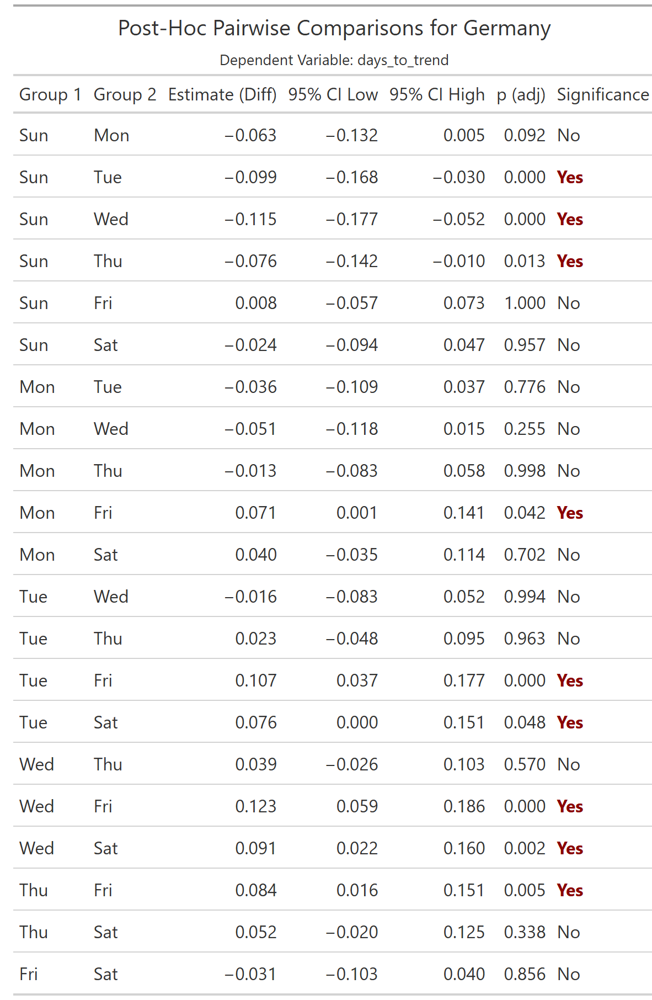

 

Similarly, the German dataset reflects regional day-of-week velocity variations, with late-week uploads experiencing longer lag times prior to trending.

#### South Korea (Equal Variance Dataset)
For the South Korean dataset, Levene's Test was not statistically significant ($p > 0.05$), satisfying the assumption of homogeneity of variance. Therefore, a standard **One-Way ANOVA** with **Tukey’s HSD post-hoc test** was applied.

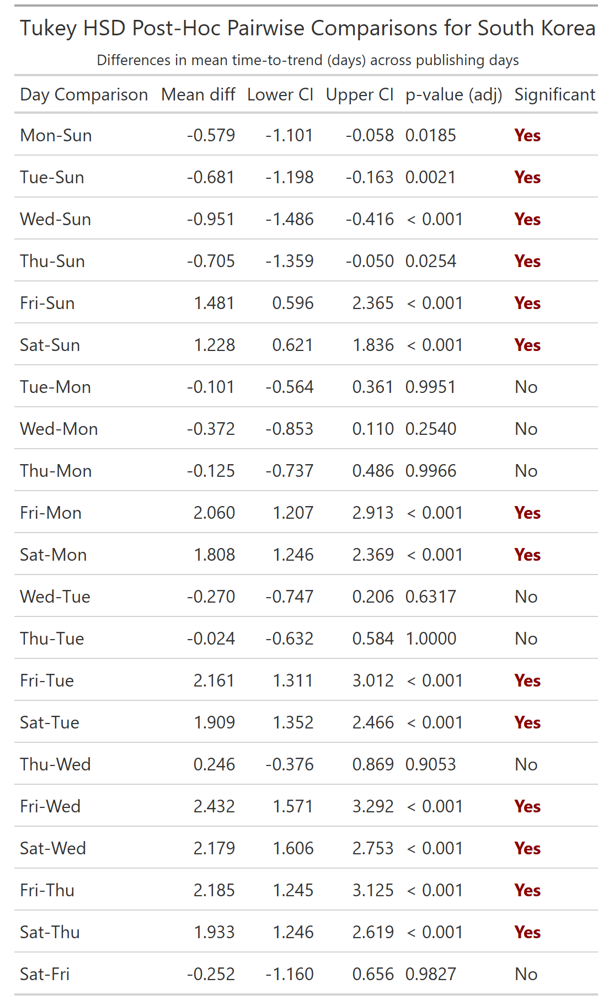

 

---

### 2. Category Reliance on Audience Engagement

To test whether interactive categories rely more heavily on audience participation, categories were segmented into *High Interaction* (*Music*, *Gaming*, *Entertainment*) vs. *Informational* (*News & Politics*, *Education*, *Tech*). **Welch’s Two-Sample $t$-tests** were executed to accommodate unequal variances between clusters.

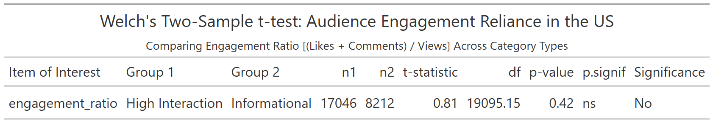

 

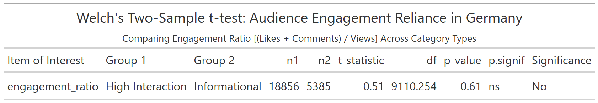

 

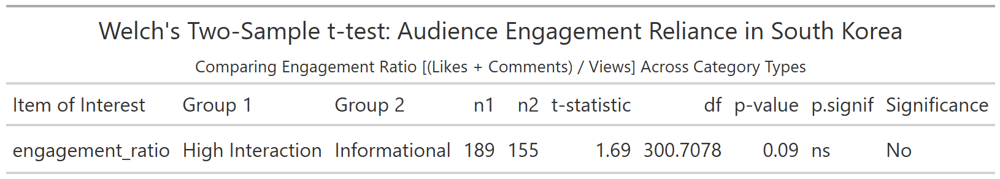

 

Cross-regional comparisons confirm that different categories do not generate a statistically significant difference in audience engagement to prove that one category inspires more viewers to like or comment a video. 

---

### 3. Clickbait Title Elements vs. Like Conversion Rate

To measure the influence of title stylistic markers on view-to-like conversion ($\text{Likes} / \text{Views}$), both linear (**Pearson $r$**) and non-parametric rank (**Spearman $\rho$**) correlation coefficients were evaluated.

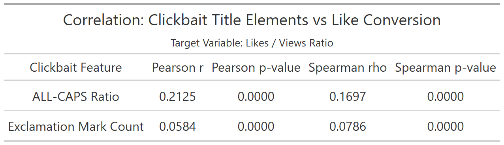

In the US dataset, the ALL-CAPS title ratio exhibits a weak-to-moderate positive correlation ($r = 0.2125, \rho = 0.1697, p < 0.0001$), suggesting that visual capitalization urgency slightly increases viewer propensity to leave a like. Conversely, exclamation mark counts yield minimal practical correlation ($r = 0.0584$).

 
 

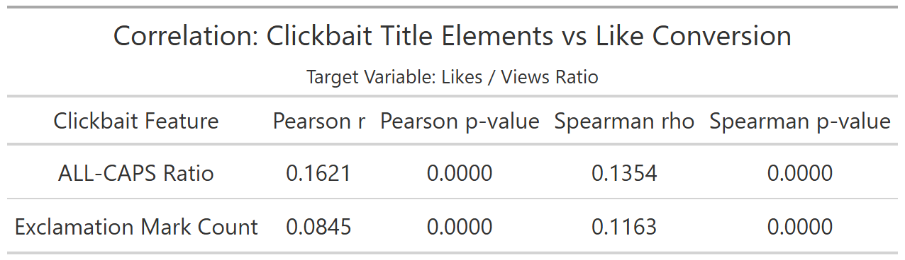

German trends align closely with US metrics, indicating that while $p$-values reach statistical significance due to large sample sizes, punctuation frequency has negligible predictive power.

 
 

The South Korean market exhibits identical directional trends, confirming platform-wide consistency in viewer response to title formatting.

 

---

### 4. Categorical & Sentiment Drivers of Comment Disabling

To evaluate whether creators disable comments randomly or in response to sensitive categories and high dislike ratios ($\text{Dislikes} / \text{Views}$), **Chi-Square ($\chi^2$) Tests of Independence** and **Cramér's $V$** effect size measurements were performed.

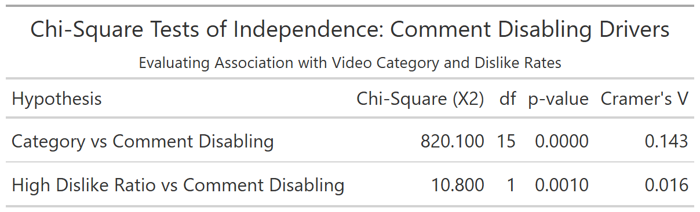

Although $p$-values are statistically significant ($p < 0.0001$), Cramér's $V$ values remain below $0.10$ in the US market, confirming that comment disabling operates essentially independently of category type or high negative sentiment ratios.

 
 

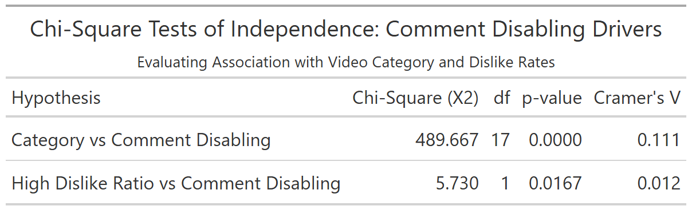

 
 

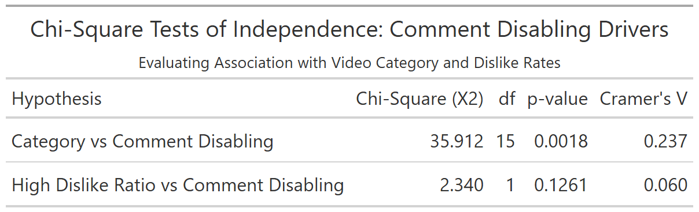

 
 

The German and South Korean datasets reinforce this independence, demonstrating that comment moderation choices are largely driven by channel-level creator preferences rather than macro-category or sentiment thresholds.

---

# Conclusion
This cross-regional investigation reveals key algorithmic and behavioural patterns on YouTube:

1. **Temporal Velocity:** Upload timing significantly impacts time-to-trend velocity across all regions, favouring mid/late-week uploads.
2. **Engagement Dynamics:** Regional audience interaction patterns differ by category grouping, but remain structurally stable across geographic boundaries.
3. **Clickbait Utility:** Capitalization serves as a minor positive catalyst for like conversions, whereas exclamation marks yields no meaningful engagement return.
4. **Moderation Choice:** Comment disabling remains structurally independent of video category and dislike density, reflecting creator-specific moderation strategies rather than platform-wide algorithmic restrictions.