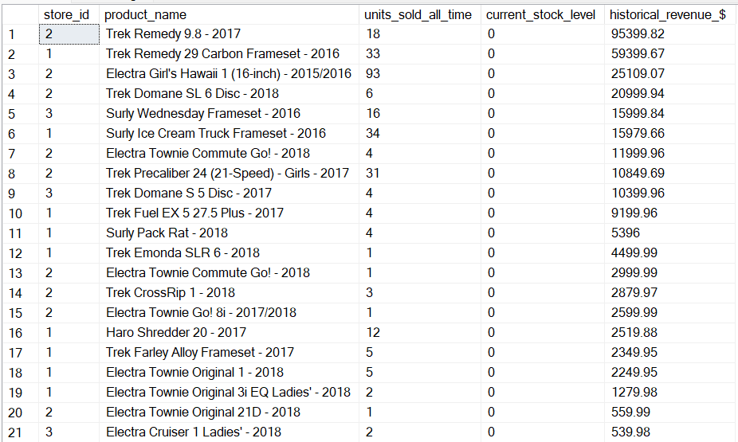
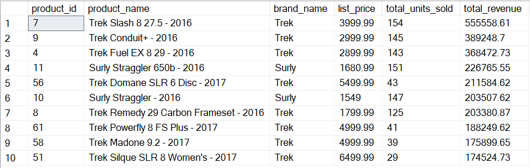
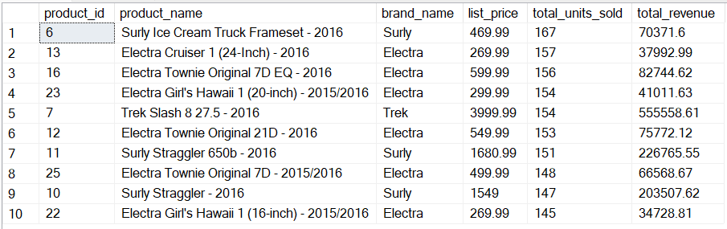
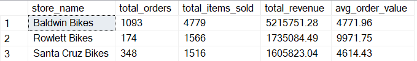
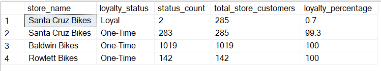
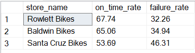

# Bike Retail Operations & Logistics Analysis
A data-driven investigation into store performance, customer loyalty, and supply chain bottlenecks.

## Executive Summary
Analysis of the current retail landscape reveals a critical retention crisis driven by operational inefficiencies. While Baldwin Bikes leads in sales volume and Rowlett Bikes captures high-value transactions, the business suffers a 0% repeat-customer rate at major locations. This is largely attributed to 32-46% shipping failure rate and significant latent demand caused by out of stock products. Addressing supply chain automation and recalibrating customer delivery expectations are the primary recommendations to stabilize the business.

## Tools Used
SQL Server for data cleaning, multi-table joins, and CTEs.

## Insight 1: Latent Demand
A significant portion of products are currently out of stock, representing a massive loss in potential revenue.
The recommendation is to implement an automated inventory management system , using a "Just-in-Time" replenishment model where low-stock triggers automated purchase orders to prevent revenue leakage.  
  

## Insight 2
The data shows a clear distinction between revenue drivers and volume drivers.  
  
Trek remains the primary revenue engine, while Surly and Electra dominate in unit volume.  
  

Baldwin Bikes is the volume leader, moving 4,779 units to date. Interestingly, it also sold the company most expensive single unit ($11,999.99).  
Rowlett Bikes is considered the "premium boutique", maintaining the highest average order value, suggesting a customer base with higher purchasing power.
  

## Insight 3
A deep dive into completed transactions (Status 4) reveals a near-total failure in customer retention.
  

The data shows Santa Cruz having a negligible 0.7% loyalty rate, while Baldwin and Rowlett Bikes have 0% repeat buyers for completed orders.  

High sales volume from Baldwin is currently a "leaky bucket", meaning the business does get customers, but fails to retain them. This is likely due to the shipping problems.

## Insight 4
The next step is to identify whether there are shipping problems that could be causing the lack of repeat buyers.
  

The lack of retention is directly correlated with a breakdown in logistics. All stores are currently in an operational deficit.  

The stores' overpromising of 1-2 day delivery windows fails to meet deadlines in 32 to 46% of cases.  

Santa Cruz is the highest-risk location with a 46.31% failure rate (which includes late and overdue orders).  

Further research was performed to rule out whether a particular brand of bikes is causing these issues, however, no significant pattern was identified. This means the shipping issue is internal.

A possible solution is to change the promise to 3-5 day window instead. This creates a buffer for warehouse operations and improves customer experience by meeting a realistic promise.

## Recommendations
* Recalibrate delivery windows
* Automate reordering
* Audit Santa Cruz operations. Investigate why nearly half of Santa Cruz's orders are failing, focusing on warehouse staffing or local courier issues
